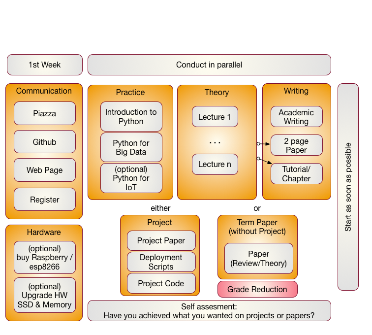
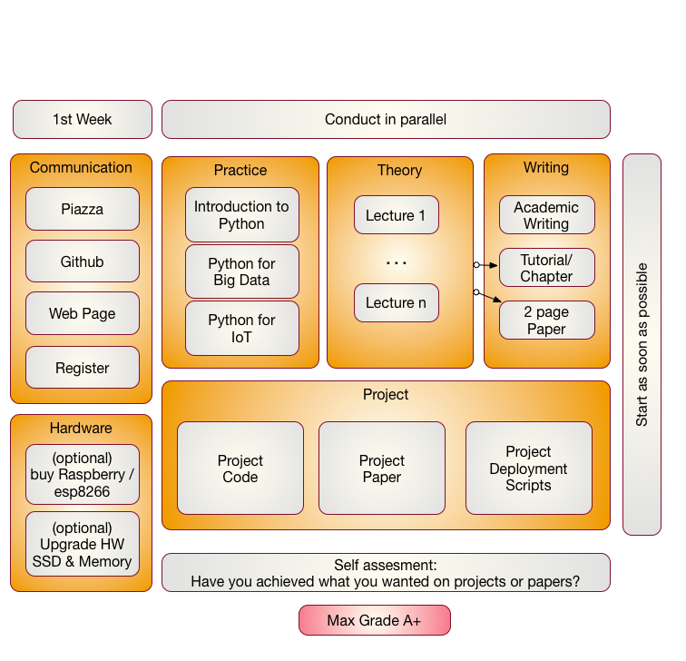

Organization
============

This class is an online class. Online classes require you to be very
disciplined in order to execute the tasks necessary for the class. It is
it your responsibility to organize the lessons so that you can complete
them not only by the end of the semester, but also in time for
conducting your assignments. This is a great opportunity for you to
structure the class based on your availability. The classes are attended
by two different set of students. One set are pure online students,
while to other are residential students. For the residential students we
have a mandatory in person meeting that takes place at the posted
location and hours. For pure online students we have weekly online hours
that we will identify based on our availability and a doodle poll.

Figures  *Components of the Class i523, e534* and *Components of the
Class e516, e534 and e616* showcase the different part of the class.
Please note that the in i523 and i524 the project can be substituted
for a term paper only that does not require programmning. As this is a
significnat reduction in work and goals for that class the project
report will be down graded by a full grade to adjust for this.

There will not be any bonus projects or tasks to improve
gradesassignments that did not receive an A or A+. Instead make sure
your deliverables are truly outstanding. 

{width=100%}

{width=100%}

The content for this class will be available through this document
that will be regularly updated. All communication is done with
Piazza. We have prepared a special section on how you can access
Piazza directly from Canvas.  Please follow the instructions and let
us know if there are any issues.

First Week
----------

In the first week we will be introducing you how we communicate.
Naturally you need to register for the class. Once you register you need
to set up a number of services. Please ssee Assignment 0 for details

IoT Hardware
------------

As part of this class you also have the ability to take part in some
Internet of Things related projects and assignments. If you like to
experiment with real hardware, I recommend you to buy a
Raspberry PI 3 (about $50 with power supply)

Access to Clouds
----------------

As part of the course you will also need access to a computer. We will
try best to provide you with access to suitable computers for the class,
but do be reminded that the amount of time and access to supercomputers
and clouds we offer is limited. Our class policy is to use the compute
resources only when you really need them. Thus you **must** shut down
your VMs when they are not in use. It would be a violation of class
policy if we would find out through an analysis of the cloud logs that
you unnecessarily keep your VMs running. Thus we will implement a
**strict policy** that you must record yourself how many hours you run
VM's and provide this information to us. We will than compare that time
with the time recorded by the computer system as well as with your
target application and will deduct points form your project if you can
not justify why you have not shut down your VMs. A resource section
needs to be added to your report justifying the used resources.

Why is this such a big deal you may ask? For example we estimate if
every student in class violates this policy it would cost about $200000
to rent the time for this on a public cloud. Due to this high cost, we
no longer tolerate deliberate violations of the policy and will
terminate your account. Furthermore, violators will have to find
alternative resources to conduct their projects while not using our
resources. In our case the problem is even beyond the issue of cost as
our allocation on the clouds would be terminated due to abuse and **no
student**, including those that follow policies, could use the cloud. It
may take weeks to reestablish cloud access and would effect every
student in class.

We will provide clarification for accessing cloud resources and teach
you how to avoid getting in such a situation. I am sure that a future
employer of yours will be real happy if you have a deep understanding of
resource vs. cost estimate.

Listing the used computer time for your project is part of your
report.

Using Your Own Computer
-----------------------

In many cases however you could be using your own personal computer, but
make sure the computer is up-to-date. This does not mean that you need
to buy a new computer, or need to upgrade it. However, if you consider
an upgrade of an older machine please consider the following.

These days we recommend that your computer has a solid-state drive and
fast maximized memory. Todays home computers have typically 16 GB off
main memory, a minimum of 8GB is required for most operating systems.
Make sure you follow your upgrade guide to your computer and by suitable
memory chips. In most cases you have to buy them in pairs and make sure
all chips in your computer are the same. When it comes to buying a
solid-state drive, make sure that you buy one that is compatible with
motherboards bus speed. As you may want to reuse your solid-state drive
at a later time I suggest to get a 6GB/s SSD and not a 3GB/s.

Students that only had a chromebook and took this class gave us the
feedback that they are too inconvenient as they do not allow you to
program directly in python on them.

If money is an issue, you can buy a Raspberry Pi and edit your programs
there and when satisfied run them on a cloud.

We also like to remind you that this course does not require you to
purchase expensive text books, thus the money you safe on this could be
used in upgrading your hardware or renting yourself from your own money
time on AWS. Hoever, be careful with the cloud its easy to spend lots of
money there if you ar enot careful.

Parallel Tracks
---------------

In this class we start out with three parallel tracks. You will be doing
all of them.

### Track 1: Practice

Trak 1 introduces you to using python for Big Data. Although you do not
need to know any programming language, it is certainly useful as it will
make this course much easier for you. We had students that had no prior
programming knowledge and successfully completed the course. So we know
it can be done. We also had other students that dropped the class as
they felt they need more time to learn programming. It will be up to you
to make that assessment. The course is designed in such a fashion, that
there is enough time to learn programming and do a project.

We provide you with a general introduction to Python. This includes
enough knowledge so you can conduct a project with it. We will
reinforce this knowledge while exposing you to IoT devices that you
can program in Python such as the the Raspberry PI. Residential
students that have purchased ahave access to 100 Raspberry PIs. They
can than compare the compute power of that cluster with your own
Laptop, or a cluster hosted in the cloud.

We will build on these technologies to introduce you to python libraries
that can be used for big data. We also will introduce you to analytics
algorithm such as k-means and others to understand some of their
intrinsic functionality.

Optionally, we also offer you the chance to integrate DevOps into your
projects which is typically covered in I524, e516, e534, and e616 for
However, we have a real simple solution while using our own cloudmesh
cmd5 to provide an easy interface to reproducible environments that
could be used by anyone in the class.

### Track 2: Theory

The theory track includes a number of online lectures that introduces
you to a variety of topics related to Big Data. You have especially
the opportunity to become part of a project that would contribute to
the understanding and the development of a Big Data Architecture
developed in collaboration with NIST. Other topics that are covered
include IoT, Health Care, Physics, Science, Biology, Genomics, and so
forth. We will update the Theory track on a weekly basis and will
release lectures in the specified areas. 

### Track 3: Writing

This track will introduce you into how to write an academic paper and
conduct proper bibliography management. Knowing how to write is a
preparation for your term project. If you elect to do a term paper you
still have to conduct the programming assignments.

You will be writing a paper that is 2 pages long possibly within a
team. In case you work in a team you have to produce as many papers as
you have team members.  We like to avoid that all students take the
same topic, so we will use github to avoid that everyoone choses the
same topic.  Knowing how to write is a preparation for your term
project/paper.

We noticed a curious observation in previous classes. Papers and
Project reports must be written in latex

In addition to these reports you will also prepare a contributed
chapter to the class that is written in markdown. This will prepaer
you to write reproducable instalation instructions for the class and
focus you on the most important aspects.

### Track 4: Term Paper/Project

The major deliverable of the course is a term project or paper. The
exact details will be posted on the Web page and depends on if you
conduct the project/paper in a team or alone. Details will be available,
but will likely replicate what we set for I524. The important part is
that you start on this project once you are sufficiently familiar with
Track 1-3. However you can also use the project to for example learn
python and engage in a goal oriented learning activity while working
towards implementing your project and integrating the python lessons
that you encounter. The same is valid for the theory.

It is **expected** that you identify a suitable analysis and data set
for the project and that you learn how to apply this analysis as well as
justify it.

More details will be posted once we have introduced you to some
elementary concepts so we can discuss them easier.

Furthermore, it is also important to note that if you do not do a
project (this is your option) the maximum grade for the entire class is
limited to an A-. It will be up to you to assess what you want to do and
self assessment is a real good way to do that. In any case, you should
not expect to get an A if you yourself are not convinced about your
project or are unsure about it. Common sense prevales.

### Self Discipline

As this class has no graded tests and only few graded homework, we like
that you deliver an **exceptional** project report or paper. Instead of
focussing on preparing for tests we provide you with the opportunity to
**explore** without the pressure of grades. However you should not give
up or take the easy way out or it will effect you in your project
execution. Also, to achieve your best do not just say: *We do not have a
test, so let me not do this weeks assignment, let me do it next week*.
After a couple of times with this attitude you will be in big trouble.
All this requires discipline. For example, if you believe you are so
good that you can do a project within one week before deadline, you will
**certainly fail**. To avoid this and to introduce discipline, you will
also be monitored on progress and we check your github for activities
which will be part of the participation grade.

### Fun

I hope you have fun and are able to integrate in the projects your own
thoughts and interrests.

### Uniqueness

We will try to have every project or paper to be non overlapping with
another topic, If there are overlaps we may ask you to modify your
focus.
