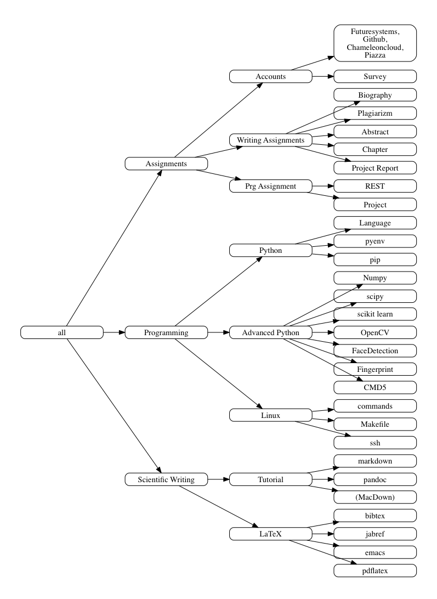

## Syllabus :o:

:warning: This document is under construction and will change.

It is obvious that some lectures overlap between different classes as
they introduce you or refresh your knowledge about common topics and
themes. This especially is valid for aspects dealing with

* Writing Scientific Papers
* Writing Tutorials
* Learning or refreshing you knowlede on python

However it includes also class specific lectures. Both are listedin
graphical form in the next two images. The table of conetent for this
and our other documents will provide you easily with the ability to
locate them easily and follow the apropriate lectures. It is straight
forward. Only thing to remember is that you actually have to read **all**
posts on piazza as well as the documents that relate to your
class. Links to the documents will be added throughout the semester
once they become available.

Figure: Common class components

Figure: Class specific components

