Horizon Graphical User Interface {#C:cc-horizon}
================================

Configure resources
-------------------

Once your lease is started, you are almost ready to start an instance.
But first, you need to make sure that you will be able to connect to it
by setting up a key pair. This only has to be done once per user per
project.

Go to Project \> Compute \> Access & Security, then select the Key Pairs
tab.

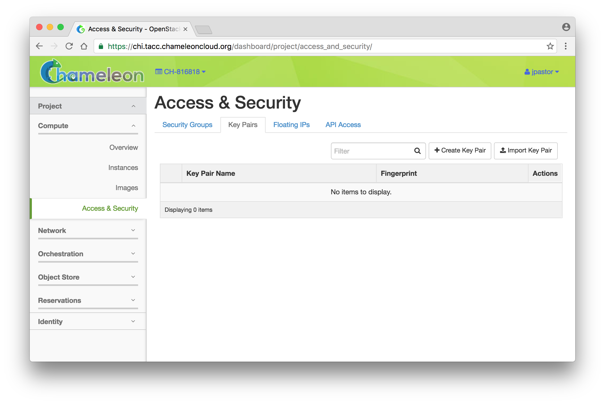{width="0.8\columnwidth"}

Here you can either ask OpenStack to create an SSH key pair for you (via
the "Create Key" Pair button), or, if you already have an SSH key pair
on your machine and are happy to use it, click on "Import Key Pair".

If you chose to import a key pair, you will be asked to enter a name for
the key pair, for example laptop. In the "Public Key" box, copy the
content of your SSH public key. Typically it will be at
\~/.ssh/id\_rsa.pub. On Mac OS X, you can run in a terminal:
 `cat ~/.ssh/id_rsa.pub  pbcopy`\
It copies the content of the public key to your copy/paste buffer. Then
you can simply paste in the "Public Key" box.

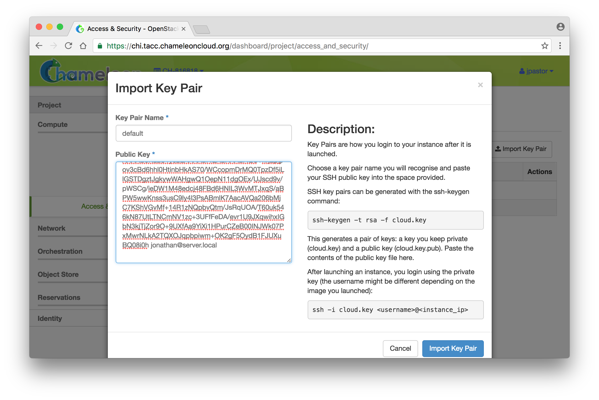{width="0.8\columnwidth"}

Then, click on the blue "Import Key Pair" button. This should show you
the list of key pairs, with the one you just added.

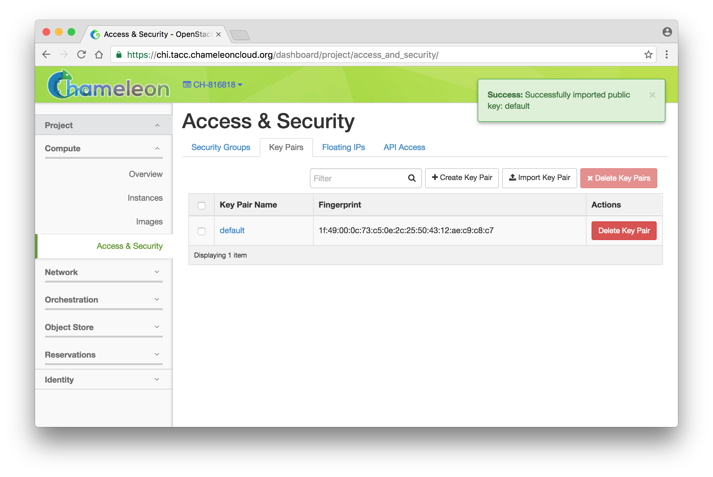{width="0.8\columnwidth"}

For those already familiar with OpenStack, note that Security Groups are
not functional on bare-metal. All instances ports are open to the
Internet and any security group rule you add will not be respected.

Now, go to the "Instances" panel.

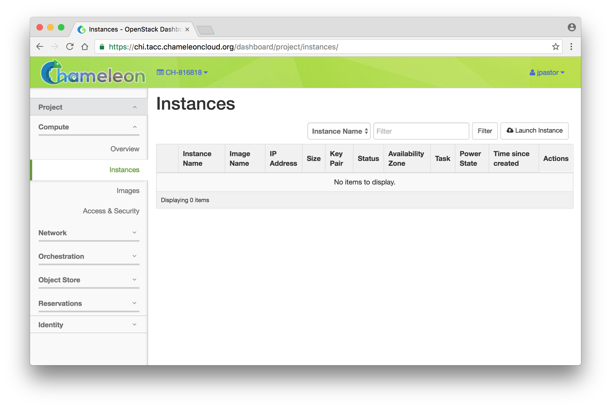{width="0.8\columnwidth"}

Click on the "Launch Instance" button in the top right corner. Select a
reservation in the Reservation box, pick an instance name (in this
example my-first-instance) and in the Image Name list select our default
environment named CC-CentOS7. If you have multiple key pairs registered,
you need to select one in the "Access & Security" tab. Finally, click on
the blue "Launch" button.

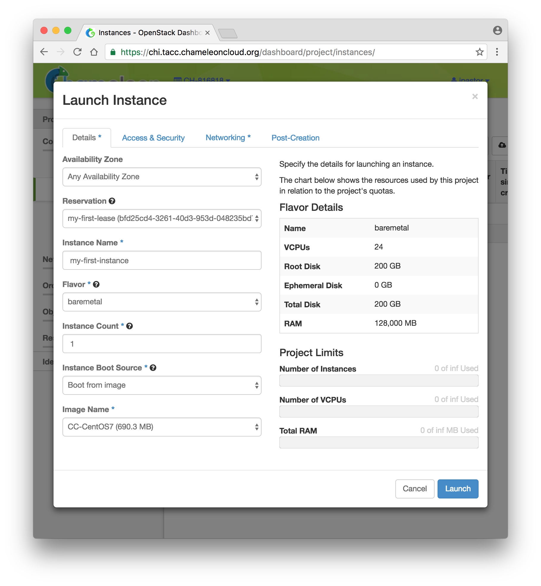{width="0.8\columnwidth"}

The instance will show up in the instance list, at first in Build
status. It takes a few minutes to deploy the instance on bare-metal
hardware and reboot the machine.

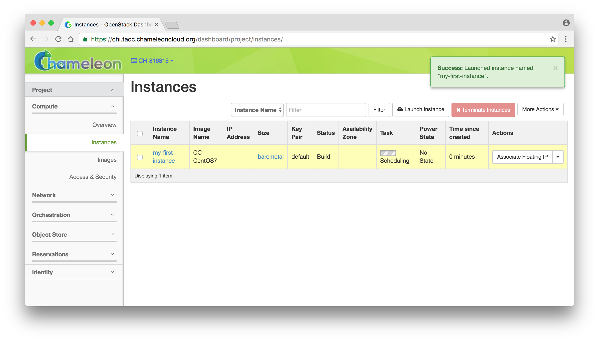{width="0.8\columnwidth"}

After a few minutes the instance should become in Active status and the
Power State should be Running.

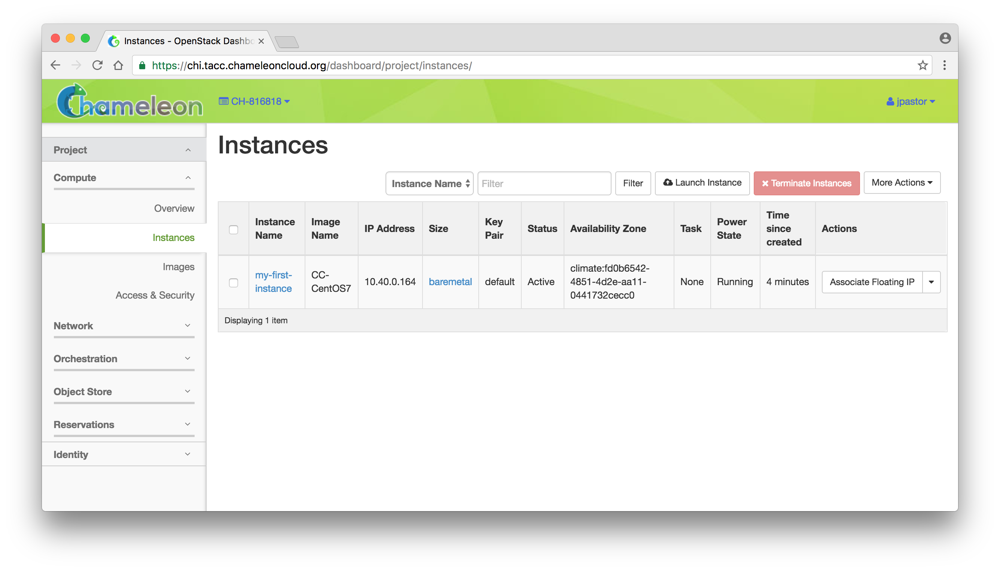{width="0.8\columnwidth"}

At this point the instance might still be booting: it might take a
minute or two to actually be accessible on the network and accept SSH
connections. In the meantime, you can attach a floating IP to the
instance. Click on the "Associate Floating IP" button. You should get a
screen like the one below:

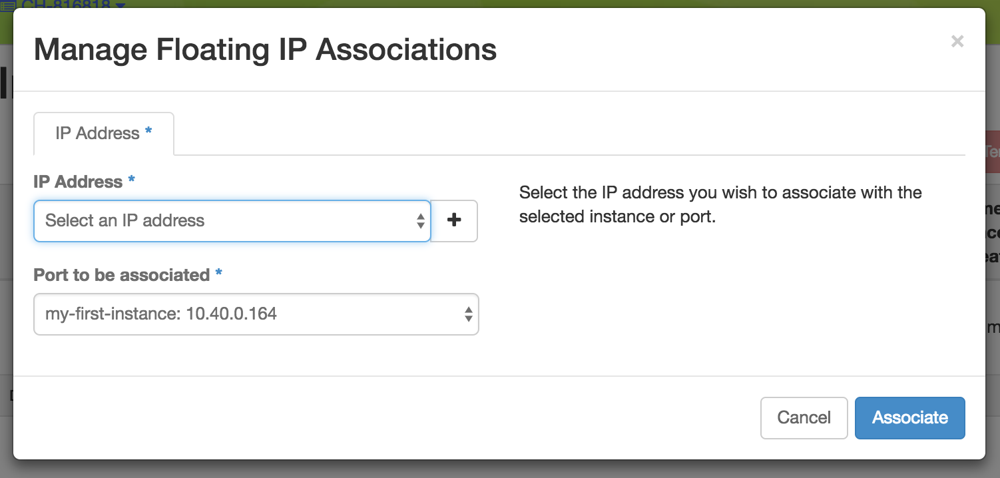{width="0.8\columnwidth"}

If there are no unused floating IP already allocated to your project,
click on the + button. In the window that opens, select the ext-net pool
if not already selected by default and click on the blue Allocate IP
button.

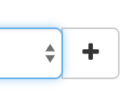{width="0.1\columnwidth"}

You will be returned to the previous window. The correct value for "Port
to be associated" should already be selected, so you only have to click
on "Associate".

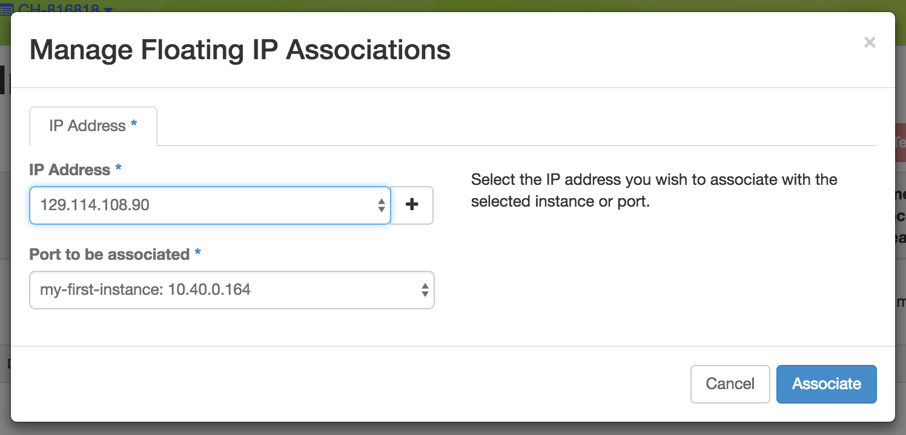{width="0.8\columnwidth"}

This should send you back to the instance list, where you can see the
floating IP attached to the instance (you may need to refresh your
browser to see the floating IP).

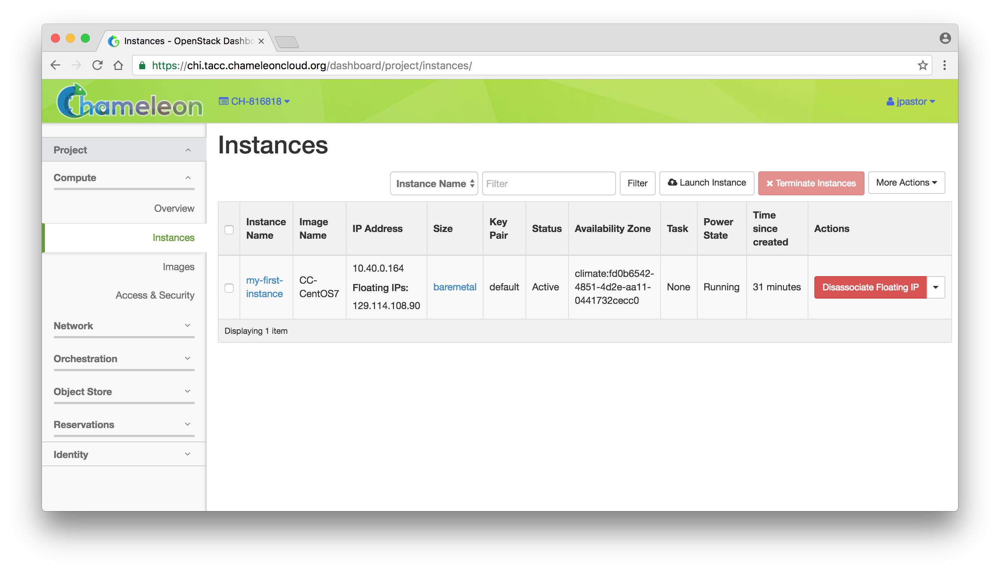{width="0.8\columnwidth"}

Interact with resources
-----------------------

Now you should be able to connect to the instance via SSH using the cc
account. In a terminal, type ssh cc@\<floating\_ip\>, in our example
this would be `ssh cc@130.202.88.241`

SSH will probably tell you:

    The authenticity of host \textquotesingle{}130.202.88.241
    (130.202.88.241) can't be established. RSA key fingerprint 
    is 5b:ca:f0:63:6f:22:c6:96:9f:c0:4a:d8:5e:dd:fd:eb. 
    Are you sure you want to continue connecting (yes/no)?

Type yes and press Enter. You should arrive to a prompt like this one:

`[cc@my-first-instance ~]$`

If you notice SSH errors such as connection refused, password requests,
or failures to accept your key, it is likely that the physical node is
still going through the boot process. In that case, please wait before
retrying. Also make sure that you use the **cc** account. If after 10
minutes you still cannot connect to the machine, please [open a ticket
with our help desk](https://www.chameleoncloud.org/user/help/).

You can now check whether the resource matches its known description in
the resource registry. For this, simply run: `sudo cc-checks -v`

As of 03/30/2018, the cc-checks command may not work on the images in
Chameleon cloud. You may have to ignore (not run) this command.

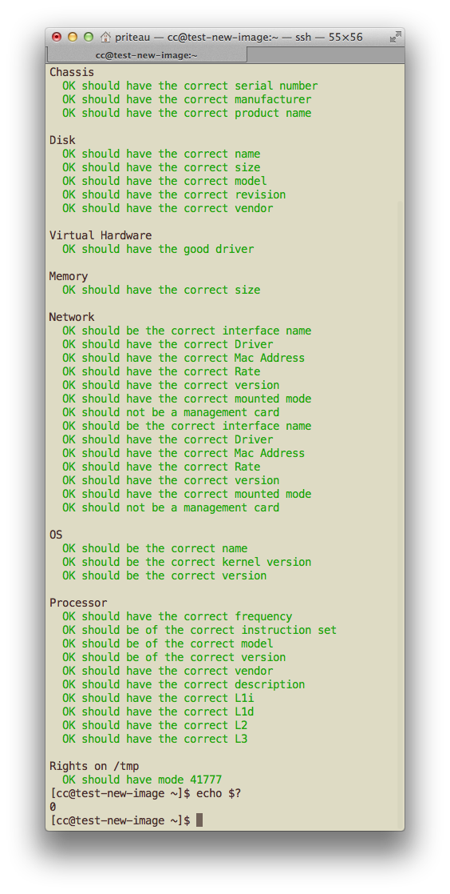{width="0.5\columnwidth"}

The cc-checks program prints the result of each check in green if it is
successful and red if it failed.

You can now run your experiment directly on the machine via SSH. You can
run commands with root privileges by prefixing them with `sudo`. To
completely switch user and become root, use
the `sudo su - root` command.

### Snapshot an instance

All instances in Chameleon, whether KVM or bare-metal, are running off
disk images. The content of these disk images can be snapshotted at any
point in time, which allows you to save your work and launch new
instances from updated images later.

While OpenStack KVM has built-in support for snapshotting in the Horizon
web interface and via the command line, bare-metal instances require a
more complex process. To make this process easier, we developed the
[cc-snapshot](https://github.com/ChameleonCloud/ChameleonSnapshotting)
tool, which implements snapshotting a bare-metal instance from command
line and uploads it to Glance, so that it can be immediately used to
boot a new bare-metal instance. The snapshot images created with this
tool are whole disk images.

For ease of use, *cc-snapshot* has been installed in all the appliances
supported by the Chameleon project. If you would like to use it in a
different setting, it can be downloaded and installed from the [github
repository](https://github.com/ChameleonCloud/ChameleonSnapshotting).

Once cc-snapshot is installed, to make a snapshot of a bare-metal
instance, run the following command from inside the instance:

`sudo cc-snapshot <snapshot_name>`

You can verify that it has been uploaded to Glance by running the
following command:

`glance image-list`

If you prefer to use a series of standard Unix commands, or are
generally interested in more detail about image management, please refer
to our [image management
guide](https://www.chameleoncloud.org/docs/user-guides/ironic/#snapshotting_an_instance).

Use FPGAs
---------

Consult the [dedicated
page](https://www.chameleoncloud.org/docs/bare-metal-user-guide/fpga/) if
you would like to use the FPGAs available on Chameleon.

Next Step
---------

Now that you have created some resources, it is time to interact with
them! You will find instructions to the next step by visiting the
following link:

-   [Monitor resources and collect
    results](https://www.chameleoncloud.org/monitor-and-collect/)
