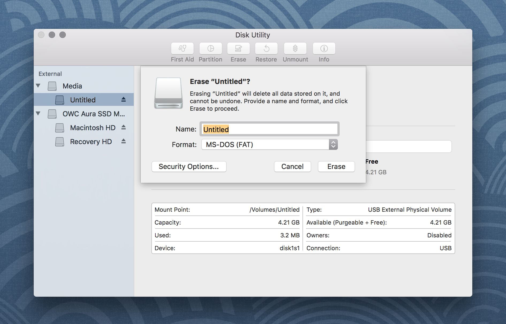
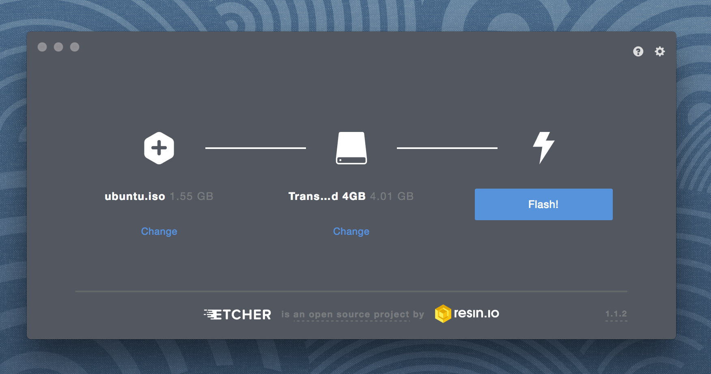

 

Ubuntu on a USB stick for OSX
=============================

Ubuntu on a USB stick for OSX via Command Line
----------------------------------------------

The easiest way to create an ubuntu distribution that can be booted from
an USB stick is done via command line. The original Web page for this
method is available at

-   <https://help.ubuntu.com/community/How%20to%20install%20Ubuntu%20on%20MacBook%20using%20USB%20Stick>

We have copied some of the information from this Web page but made
enhancements to it. Currently all images are copied form that Web page.

Our goal is to create a USB stick that has either Ubuntu 16.04.03 or
ubuntu 17.10.1 on it. You will need a USB stick/flash drive. We
recommend a 8GB or larger. Please let us know if it works for you on
larger than 8GB drives.

First you have to download a distribution of your choice. This can be
achieved while visiting the URL

-   <https://www.ubuntu.com/download/desktop>

We assume that you downloaded to iso from ubuntu to a folder called
*iso*. Next we open a terminal and cd into the folder *iso*. Now we need
to convert the is to an image file. This is done as follows and you need
to execute the command for the version of ubuntu you like to use.

Your folde will look something like this

    ls -1

        ubuntu-16.04.3-desktop-amd64.iso
        ubuntu-17.10.1-desktop-amd64.iso

For 17.10.1 you will need to generate an image with the following
command

    hdiutil convert ubuntu-17.10.1-desktop-amd64.iso -format UDRW -o ubuntu-17.10.1-desktop-amd64.img

For 16.04.3 you will need to generate an image with the following
command

    hdiutil convert ubuntu-16.04.3-desktop-amd64.iso -format UDRW -o ubuntu-16.04.3-desktop-amd64.img

OSX will append a .dmg behind the name. When considering the OS and you
only want to use one, we recommend that you use the latest OS. Please
let us know if we need to update the verion numbers. Check with the
ubuntu Web page.

At this time do not plug in your usb stick. Just issue the command

    diskutil list

Observe the output. Now plug in the USB stick. Wait till the USB stick
registers in the Finder. If this does not work find a new USB stick or
format it. Execute the command

    diskutil list

and observer the output again. Another devce will register and you will
see something like

    /dev/disk2 (external, physical):
    #:     TYPE NAME               SIZE       IDENTIFIER
    0:     FDisk_partition_scheme *8.2 GB     disk2
    1:     DOS_FAT_32 NO NAME      8.2 GB     disk2s1

Please note in this example the device path and number is recognized as

    /dev/disk2

It also says external, which is a good sign as the USB stick is
external. Next, we need to unmoundt the device with

    diskutil unmountDisk /dev/diskN

where you replace the number N with the disk number that you found for
the device. In our example it would be 2. If you see the error "Unmount
of diskN failed: at least one volume could not be unmounted", start Disk
Utility.app and unmount the volume (don't eject). If it was successful,
you will see

    Unmount of all volumes on disk2 was successful

The next step is dangerous and you need to make sure you follow it. So
please do not copy and paste, but read first, reflect and only if you
understand it execute it. We know we say this all the time, but better
saying it again instead of you destryoing your system. This command also
requires sudo access so you will either have to be in the sudo group, or
use

    su <your administrator name>

login and than execute the command under root.

    sudo dd if=ubuntu-17.10.1-desktop-amd64.img.dmg of=/dev/diskN bs=1m

(Not tested: Using /dev/rdisk instead of /dev/disk may be faster
according to the ubuntu documentation)

Ubuntu's Web page also gives the following tips:

-   "If you see the error dd: Invalid number '1m', you are using GNU dd.
    Use the same command but replace bs=1m with bs=1M."

-   "If you see the error dd: /dev/diskN: Resource busy, make sure the
    disk is not in use. Start Disk Utility.app and unmount the volume
    (don't eject)."

You will see an error window popping up telling you: **The disk inserted
was not readbale by this compute**. Please, leave the window as is and
instead type in on the terminal.

    diskutil eject /dev/diskN

Now remove the flash drive, and press in the error window **Ignore**\
Now you have a falsh drive with ubuntu installed and you can boot from
it. To do so, please

**restart your Mac and press option key**

while the Mac is restarting to choose the USB-Stick

You will need a plug for USB keyboard, USB mouse, and netwwork cable.

There are some issue from this point on.

    sudo apt-get update

Add universe to the window for application updates

see <https://help.ubuntu.com/community/Repositories/Ubuntu>

    sudo apt-get install vnc4server

Start the server and set up a password

    vncserver

The next section is untested and needs verification.

Boot from the USB Stick
-----------------------

To boot from the USB stick, you need to restart or power-on the Mac with
the USB stick inserted while you press the Option/alt key.

The launch *Startup Manager* will be started showing a list of bootable
devices connected to the machine. Your USB stick should appear as
gold/yellow and labelled *EFI Boot*. Use your curser keys to move to the
most right EFI boot device in that list (likely the USB stick) and press
ENTER. YOu can also use the mouse.

{width="0.8\columnwidth"}

A boot menu will shortly start up and after you press again ENTER your
machine will boot into Ubuntu.

For more information on how to setup ubuntu see:

-   <https://tutorials.ubuntu.com/tutorial/tutorial-install-ubuntu-desktop#0>

After you have booted and looged in, you need to update the
distribution. We recommend that you switch on Universe in the
applications settings.

Next you need to issue in the command terminal

    sudo apt-get update

You will likely see some warnings with number 95 which you can ignore.
Please report your experience and we update this page based on your
feedback.

Ubuntu on a USB stick for OSX via GUI
-------------------------------------

An alternative to the Command Line solution to create an USB stick with
bootable UBuntu on is to use the OSX GUI. This method is more complex
than the command line solution. In addition as we are learning about
cloud computing in this book, it is of advantage to learn how to do this
from commandline as the replication of the approach via commandline is
easier and more scalable. However for completness, we have also included
here the GUI-based method.

The material in this section was copied and modified from

-   <https://tutorials.ubuntu.com/tutorial/tutorial-create-a-usb-stick-on-macos>

You will need a USB stick/flash drive. We recommend a 8GB or larger.
Please let us know if it works for you on larger than 8GB drives.

### Install Etcher

Etcher is a tool that allows you to easily write an ISO onto a USB
stick. Etcher is integrated in the OSX GUI environment and allows to
drag the iso into it for burning. Etcher can be found at

-   <https://etcher.io/>

As this is an application from unidentified developers (not registered
in the apple store), you need to enable it after downloading. To do so,
you can enable the *App Store and identified developers* in the
*Security and Privacy* pane in the System Preferences. IN case you get a
warning about running the application, click *Open Anyway* in the same
pane.

{width="0.8\columnwidth"}

### Prepare the USB stick

The Disk Utility needs to be used with caution as selecting the wrong
device or partition can result in data loss.

Next you need to conduct the following steps which we copied from the
Ubuntu Web page:

-   Launch Disk Utility from Applications\>Utilities or Spotlight search

-   Insert your USB stick and observe the new device added to Disk
    Utility

-   Select the USB stick device and select Erase from the tool bar (or
    right-click menu)

-   Set the format to MS-DOS (FAT) and the scheme to GUID Partition Map
    Check you've chosen the correct device and click Erase

{width="0.8\columnwidth"}

### Etcher configuration

Next we use Etcher to configure and write to your USB device as follows
(copied form the Ubuntu Web page):

-   Select image will open a file requester from which should navigate
    to and select the ISO file downloaded previously. By default, the
    ISO file will be in your Downloads folder.

-   Select drive, replaced by the name of your USB device if one is
    already attached, lets you select your target device. You will be
    warned if the storage space is too small for your selected ISO.

-   Flash! will activate when both the image and the drive have been
    selected. As with Disk Utility, Etcher needs low-level access to
    your storage hardware and will ask for your password after
    selection.

{width="0.8\columnwidth"}

### Write to the USB stick

When writing to the USB, Etcher will ask you for your password. It will
write the ISO file, once you confirmed the password.

You will see the progress reported to the Etcher window. Once it has
finished, Etcher will report on the successful process.

{width="0.8\columnwidth"}

After the write process has completed, macOS may inform you that \*The
disk you inserted was not readable by this computer\*. Don't select
Initialise. Instead, select Eject and remove the USB device.
